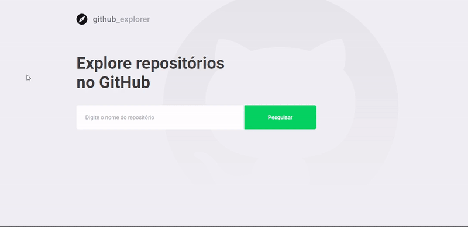
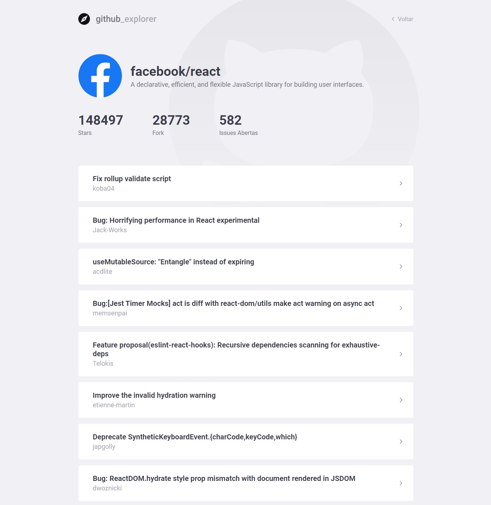

<h1 align="center">
  
</h1>


<h2 align="center">
  
</h2>


<h2 align="center">
  Dashboard
  <br/>
  
</h2>

<h2 align="center">
  Repository
  <br/>
  
</h2>

# Indice

- 📝️ [Sobre](#%EF%B8%8F-sobre)
- 👨‍💻️ [Tecnogias utilizadas](#%EF%B8%8F-tecnogias-utilizadas)
- 📋️ [IDE e Facilidades](#%EF%B8%8F-ide-e-facilidades)
- 📦️ [Como baixar o projeto](#%EF%B8%8F-como-baixar-o-projeto)
- 🤔️ [Como contribuir](#%EF%B8%8F-como-contribuir)

---

## 📝️ Sobre

O projeto **Github_Explorer** foi feito no **Bootcamp GoStack** da [Rocketseat](https://rocketseat.com.br/) para
praticar os conceitos de ReactJS.

Aplicação utiliza a API do GitHub para listar repositórios e exibir detalhes como Stars, Forks e Issues Abertas.

---

## 👨‍💻️ Tecnogias utilizadas

O projeto foi desenvolvido utilizando as seguintes tecnologias:

- [ReactJS](https://reactjs.org/)
- [TypeScript](https://www.npmjs.com/package/typescript)
- [Axios](https://www.npmjs.com/package/axios)
- [Polished](https://www.npmjs.com/package/polished)
- [Styled-components](https://www.npmjs.com/package/styled-components)
- [React-router-dom](https://www.npmjs.com/package/react-router-dom)

---

## 📋️ IDE e Facilidades

- [Visual Studio Code](https://code.visualstudio.com/)
- [Editor Config](https://editorconfig.org/)
- [ESLint](https://eslint.org/)
- [Prettier](https://prettier.io/)

---

## 📦️ Como baixar o projeto

```bash
  # Clonar o repositório
  ❯ git clone https://github.com/rafaelsouz/github_explorer.git

  # Entrar no diretório
  ❯ cd github_explorer

  # Instalando as dependências
  ❯ yarn
  # ou pode usar o `npm`
  ❯ npm install
```

## 🤔️ Como contribuir

1. Faça o `fork` deste repositório
2. Crie uma branch com sua feature:
   - `$ git checkout -b minha_feature`
3. Confirme sua branch:
   - `$ git commit -m "feature: Meu novo recurso"`
4. Envie sua branch:
   - `$ git push origin minha_feature`

---

<h4 align="center">
  Feito com ❤ por Rafael 👋️ <a href="https://www.linkedin.com/in/rafaelsouz/" target="_blank">Entre em contato!</a>
</h4>

---
